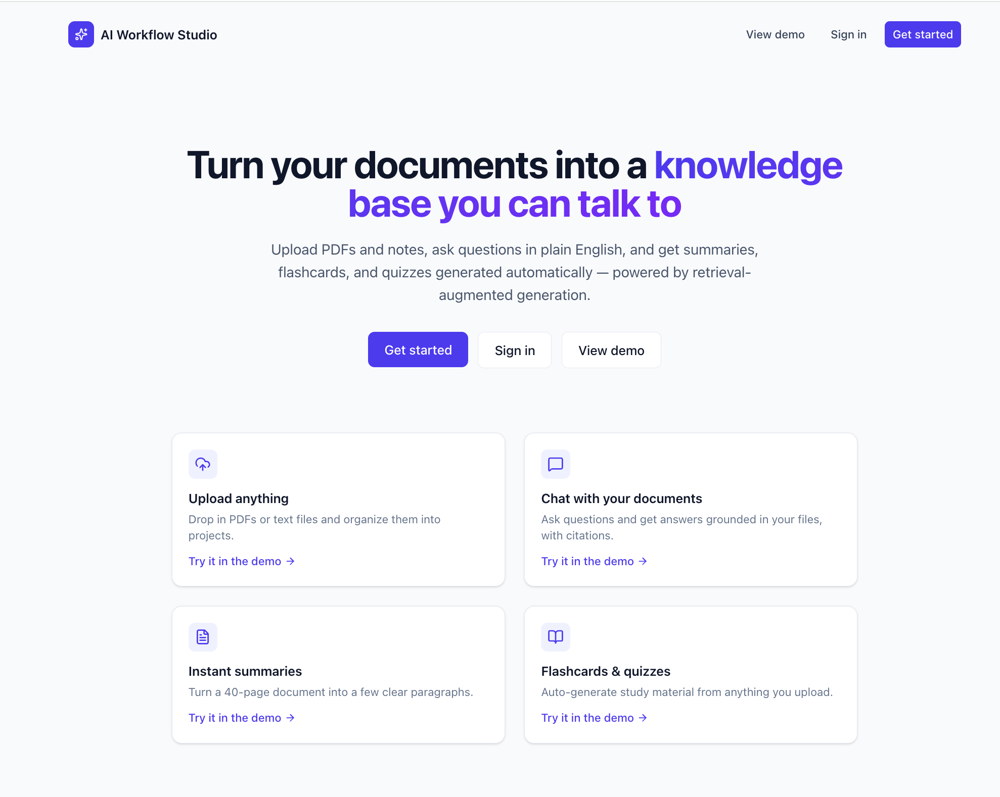
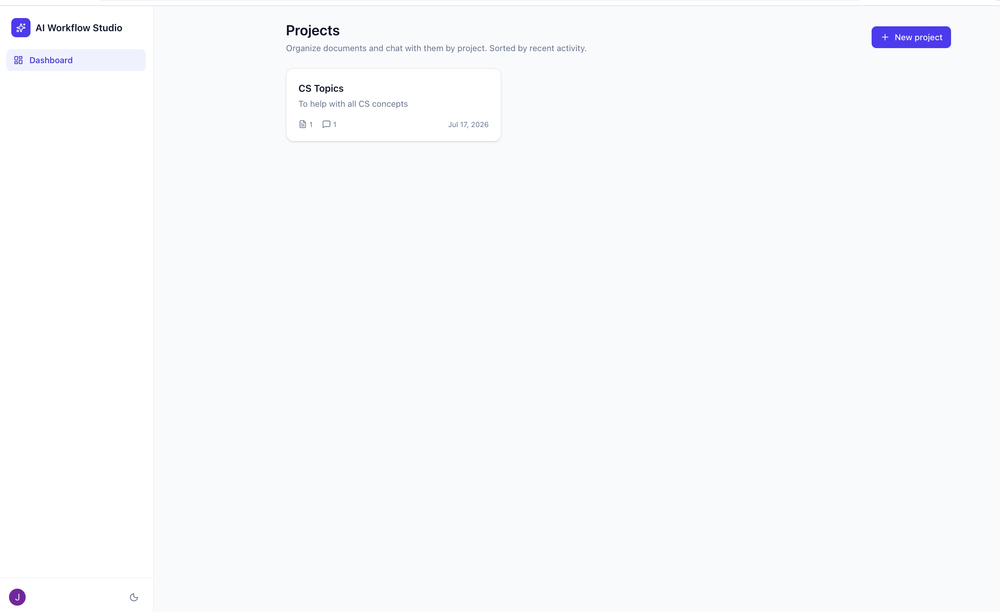
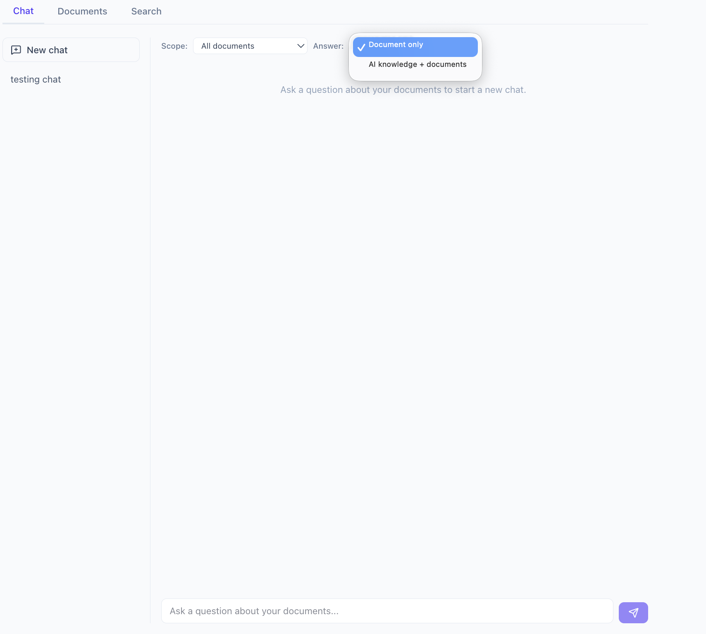
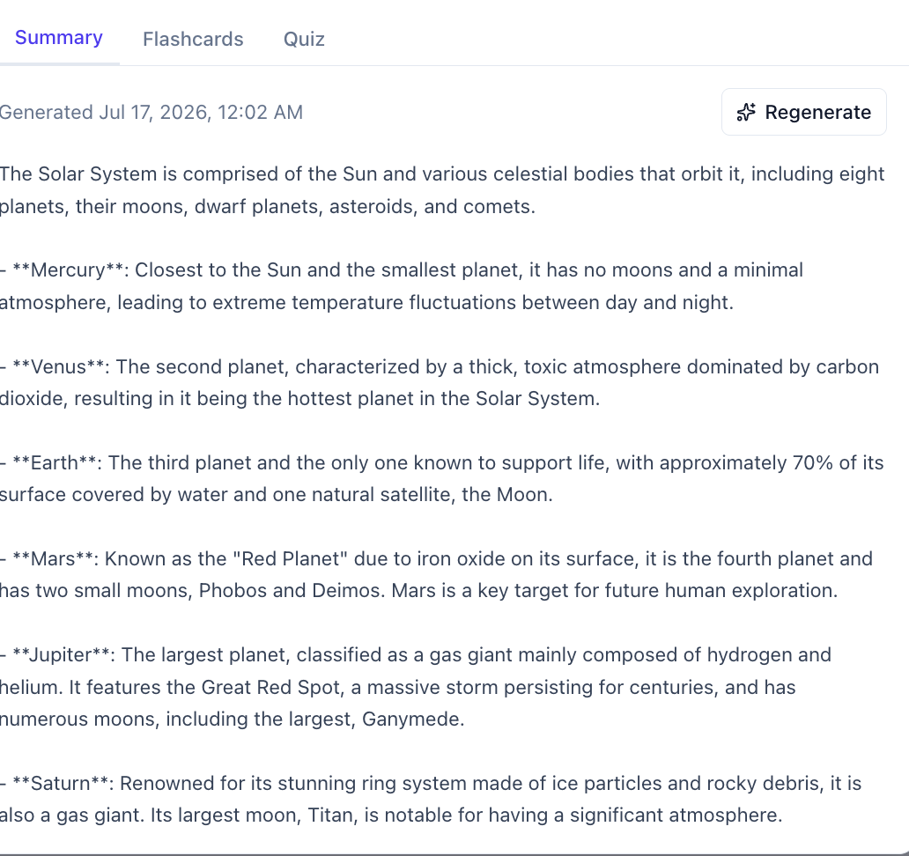
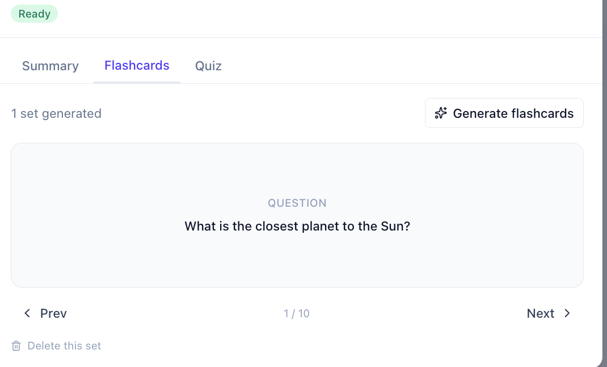
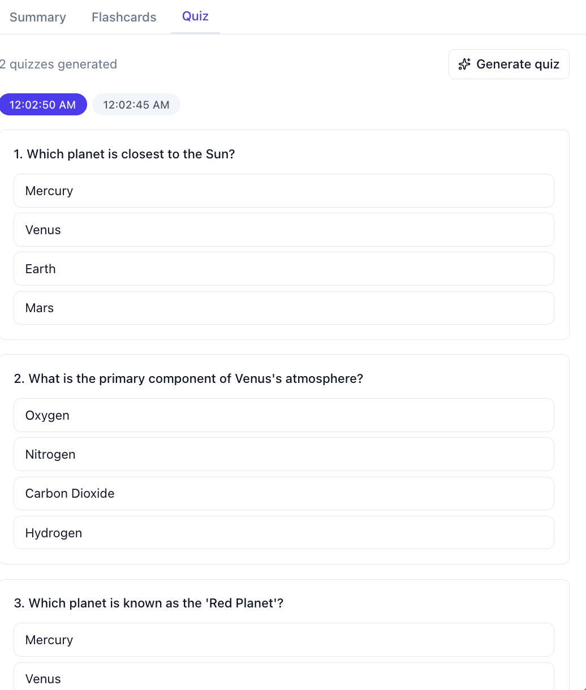
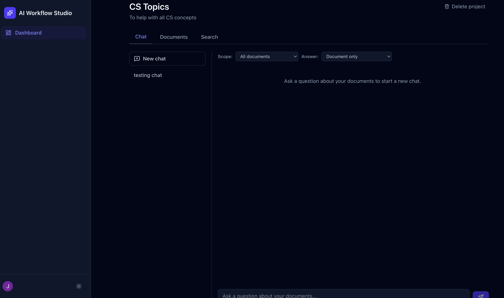

# AI Workflow Studio

AI Workflow Studio is a full stack web application I built to learn more about AI, retrieval augmented generation (RAG), and modern web development.

The app lets users upload PDF or text documents, organize them into projects, and chat with their documents using AI. It can also generate summaries, flashcards, and quizzes based on the uploaded content.

This project gave me experience building a complete application from the frontend all the way to the backend while working with authentication, databases, REST APIs, Docker, and AI integrations.

---

## Screenshots

### Landing Page



### Dashboard



### AI Chat



### AI Summary



### Flashcards



### Quiz Generation



### Dark Mode



---

## Features

- User authentication with Clerk
- Create and manage projects
- Upload PDF and text files
- Chat with uploaded documents using RAG
- AI generated summaries
- Flashcard generation
- Quiz generation
- Semantic document search
- Conversation history
- Responsive UI with dark mode

---

## Tech Stack

### Frontend

- React
- TypeScript
- Vite
- Tailwind CSS
- React Router
- TanStack Query

### Backend

- Python
- FastAPI
- SQLAlchemy
- Alembic

### Database

- PostgreSQL
- pgvector

### AI

- OpenAI API
- GPT-4o Mini
- text-embedding-3-small embeddings

### Other Tools

- Docker
- GitHub Actions
- Clerk Authentication

---

## How It Works

When a document is uploaded, the backend extracts the text, breaks it into smaller chunks, and generates embeddings using the OpenAI API. Those embeddings are stored in PostgreSQL using pgvector.

When a user asks a question, the application searches for the most relevant document chunks and sends them, along with the user's question, to OpenAI. The response is generated using only the retrieved information and includes citations back to the uploaded document.

---

## Project Structure

```
AI-Workflow-Studio
│
├── frontend
│   ├── src
│   ├── components
│   ├── pages
│   └── hooks
│
├── backend
│   ├── app
│   ├── models
│   ├── services
│   ├── api
│   └── tests
│
├── docker-compose.yml
├── render.yaml
└── README.md
```

---

## Running Locally

### Clone the repository

```bash
git clone git clone https://github.com/Jquiroz02/AI-Workflow-Studio.git
cd AI-Workflow-Studio
```

### Create environment files

```bash
cp backend/.env.example backend/.env
cp frontend/.env.example frontend/.env
```

Add your Clerk and OpenAI API keys to the `.env` files.

### Start the application

```bash
docker compose up --build
```

The application will be available at:

Frontend

```
http://localhost:5173
```

Backend

```
http://localhost:8000
```

API Documentation

```
http://localhost:8000/docs
```

---

## Environment Variables

Backend

```
DATABASE_URL
OPENAI_API_KEY
CLERK_SECRET_KEY
CLERK_JWKS_URL
CLERK_ISSUER
```

Frontend

```
VITE_API_BASE_URL
VITE_CLERK_PUBLISHABLE_KEY
```

---

## Testing

### Backend

```bash
cd backend
pytest
```

### Frontend

```bash
cd frontend
npm test
```

---

## Deployment

The application is designed to be deployed with:

- Frontend: Vercel
- Backend: Render
- Database: PostgreSQL with pgvector

---

## What I Learned

Building this project helped me gain experience with:

- Building full stack web applications
- Designing REST APIs
- Working with PostgreSQL and SQLAlchemy
- Retrieval Augmented Generation (RAG)
- Vector embeddings with pgvector
- Authentication with Clerk
- Docker and Docker Compose
- GitHub Actions
- Deploying a full stack application

---

## Future Improvements

Some things I would like to add in the future:

- Support for additional document types
- Streaming AI responses
- Better search filters
- Team collaboration
- Cloud file storage
- More AI models to choose from

---

## Live Demo

Frontend:
https://ai-workflow-studio-1detl380z-jonathan-quiroz1.vercel.app/

Backend API:
https://ai-workflow-studio-api.onrender.com

GitHub:
https://github.com/Jquiroz02/AI-Workflow-Studio
